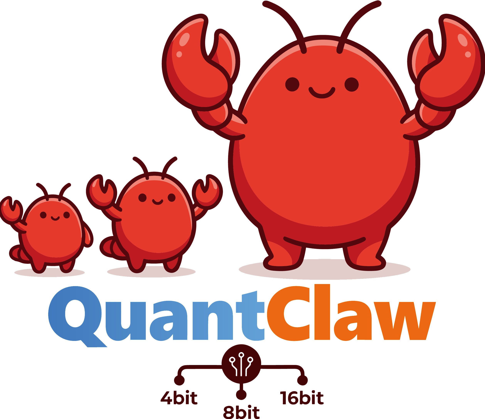
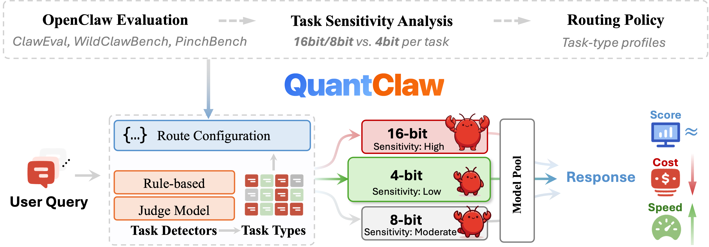
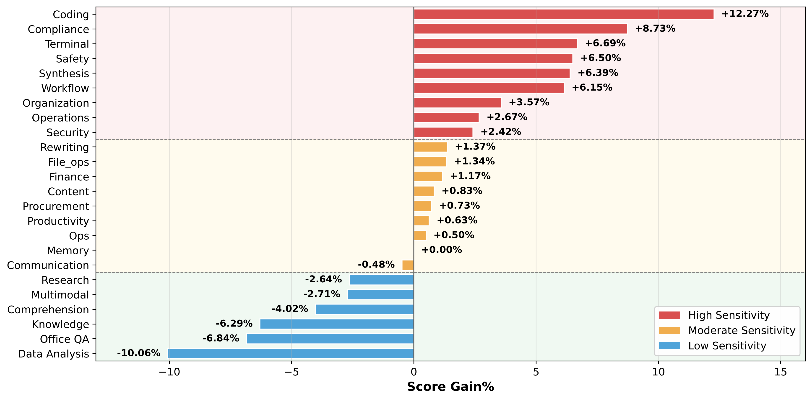
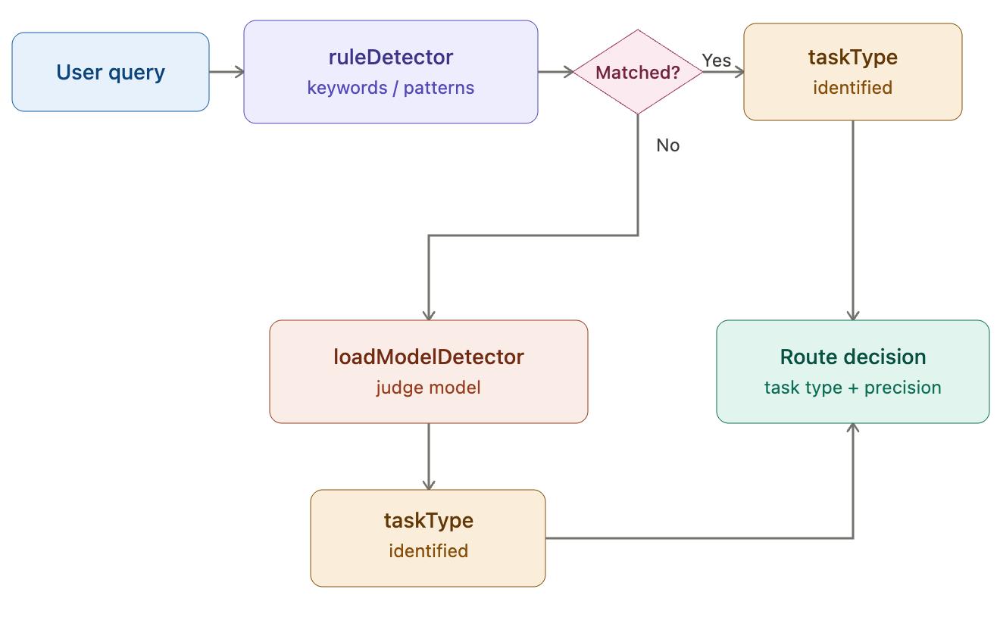
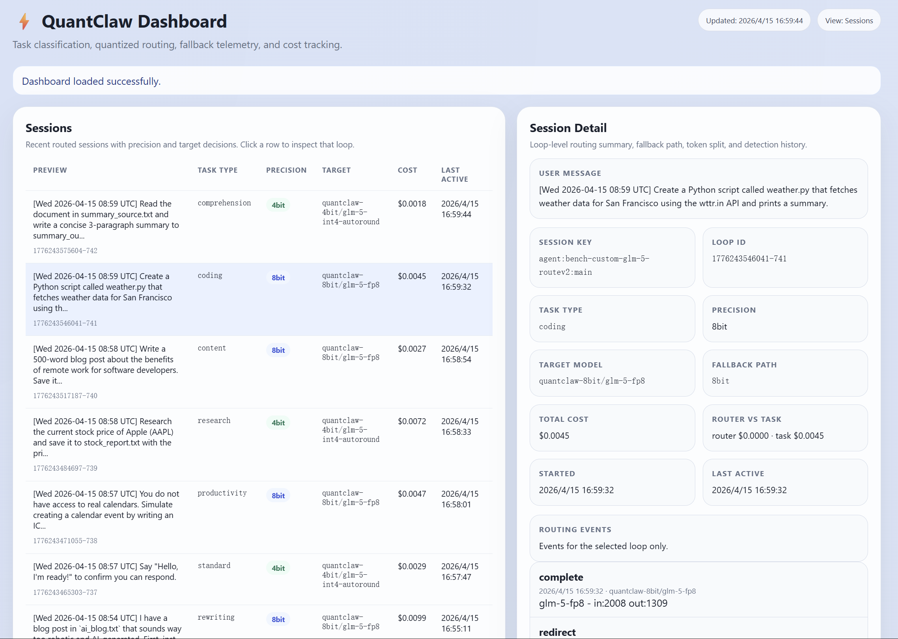
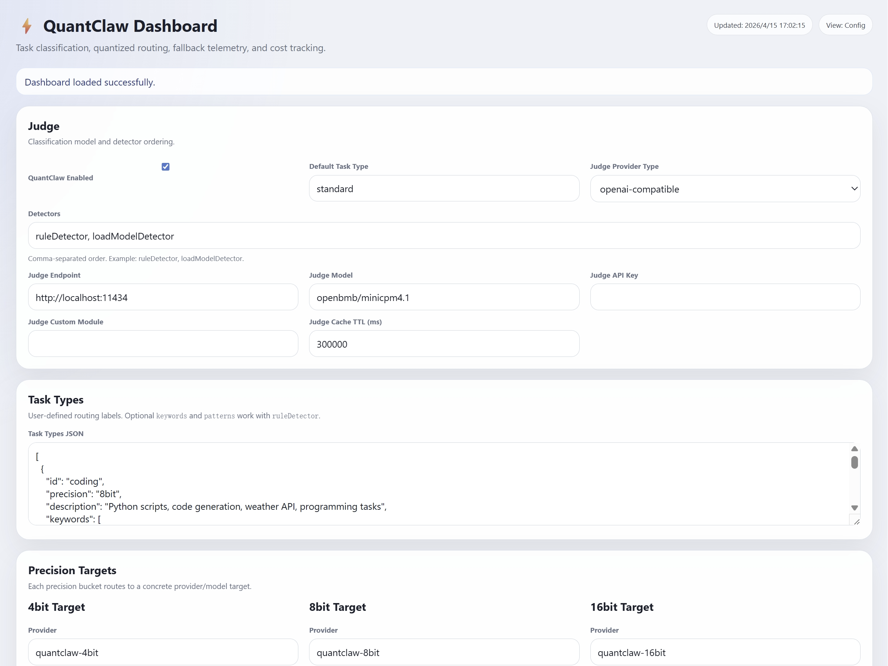
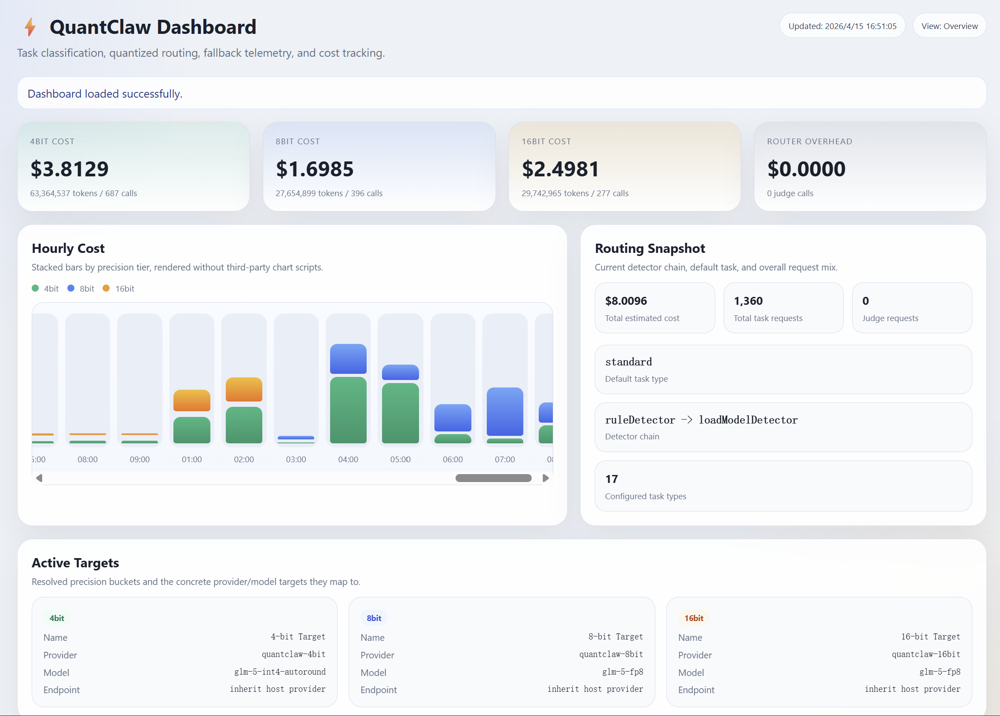

<p align="center">
  
</p>

<h1 align="center">QuantClaw：按需精度，为OpenClaw量身而量</h1>

<p align="center">
  <a href="./README.md">English</a>
</p>

<div align="center">
  <p>
    <a href="https://clawhub.ai/plugins/%40sparkengineai%2Fquantclaw"></a>
    <a href="https://sparkengineai.github.io/QuantClaw/"></a>
    <a href="PAPER_URL_PLACEHOLDER"></a>
    
    
  </p>
</div>



QuantClaw是一个面向OpenClaw的即插即用任务类型量化路由插件。它会将每个请求分类到对应任务类型，再把请求映射到`4bit`、`8bit`或`16bit`精度层，并路由到合适的目标模型，在不要求用户手动选择精度的前提下，平衡质量、延迟与成本。

## 🔍 关于QuantClaw

QuantClaw并不是凭经验拍脑袋分配模型精度，而是建立在OpenClaw量化研究之上。我们系统评估了24种任务类型、104个任务、6个模型，以及从9B到744B的不同模型规模在高精度和量化配置下的表现。

Claw-Eval（release v0.0.0）结果如下：

<div align="center">

<table>
  <thead>
    <tr>
      <th align="left">模型</th>
      <th align="center">参数量 (B)</th>
      <th align="center">BF16 / FP8</th>
      <th align="center">NVFP4</th>
    </tr>
  </thead>
  <tbody>
    <tr>
      <td><strong>GLM-4.7-Flash</strong></td>
      <td align="center">30</td>
      <td align="center">0.6370</td>
      <td align="center"><strong>0.6034</strong></td>
    </tr>
    <tr>
      <td><strong>GLM-5</strong></td>
      <td align="center">744</td>
      <td align="center">0.7130</td>
      <td align="center"><strong>0.7229</strong></td>
    </tr>
    <tr>
      <td><strong>MiniMax-M2.5</strong></td>
      <td align="center">229</td>
      <td align="center">0.6760</td>
      <td align="center"><strong>0.6823</strong></td>
    </tr>
    <tr>
      <td><strong>Qwen3.5-9B</strong></td>
      <td align="center">9</td>
      <td align="center">0.4267</td>
      <td align="center"><strong>0.4107</strong></td>
    </tr>
    <tr>
      <td><strong>Qwen3.5-35B-A3B</strong></td>
      <td align="center">35</td>
      <td align="center">0.6686</td>
      <td align="center"><strong>0.6549</strong></td>
    </tr>
    <tr>
      <td><strong>Qwen3.5-397B-A17B</strong></td>
      <td align="center">397</td>
      <td align="center">0.7048</td>
      <td align="center"><strong>0.6937</strong></td>
    </tr>
  </tbody>
</table>

</div>

- `coding`、`safety`、复杂workflow等高敏感任务通常更适合高精度。
- `research`、`multimodal`、`comprehension`、`knowledge lookup`、`office QA`、`data analysis` 等任务通常更能容忍低精度量化。

<p align="center">
  
</p>

## ✨ 核心能力

<table align="center">
  <tr align="center">
    <th><p align="center">自动适配</p></th>
    <th><p align="center">智能路由</p></th>
    <th><p align="center">完全可定制</p></th>
    <th><p align="center">内置可观测性</p></th>
  </tr>
  <tr>
    <td align="center"><p align="center"></p></td>
    <td align="center"><p align="center"></p></td>
    <td align="center"><p align="center"></p></td>
    <td align="center"><p align="center"></p></td>
  </tr>
  <tr>
    <td align="center">优先用规则分类，匹配失败则会交给judge模型处理。</td>
    <td align="center">把每个请求映射到 `4bit`、`8bit` 或 `16bit` 目标。</td>
    <td align="center">可自由调整任务类型、模式、目标模型、定价和后端。</td>
    <td align="center">持续追踪路由、token、成本、会话和实时配置变更。</td>
  </tr>
</table>

## 🚀 快速开始

**安装**

```bash
# 前提：已经安装OpenClaw。

# 通过Clawhub安装（推荐）
openclaw plugins install clawhub:@sparkengineai/quantclaw

# 如果你运行的是OpenClaw源码仓库，且PATH里没有openclaw CLI：
cd /path/to/openclaw
node openclaw.mjs plugins install @sparkengineai/quantclaw

# 或者从源码安装
git clone https://github.com/SparkEngineAI/QuantClaw-plugin.git ./quantclaw
openclaw plugins install ./quantclaw

# 如果openclaw CLI不在PATH中：
cd /path/to/openclaw
node openclaw.mjs plugins install /path/to/quantclaw
```

**创建或初始化运行时配置**

QuantClaw运行时读取的配置文件路径是：

```text
~/.openclaw/quantclaw.json
```

如果这个文件不存在，启用插件并启动OpenClaw后，QuantClaw会自动生成默认配置。如果你正在直接使用当前仓库，也可以从示例文件开始：

```bash
cp config.example.json ~/.openclaw/quantclaw.json
```

**先配置检测器和判别（judge）模型**

```json
{
  "quant": {
    "enabled": true,
    "detectors": ["ruleDetector", "loadModelDetector"],
    "judge": {
      "endpoint": "http://127.0.0.1:8000",
      "model": "BAAI/bge-m3",
      "providerType": "openai-compatible",
      "apiKey": "",
      "cacheTtlMs": 300000
    }
  }
}
```

**启动OpenClaw后打开Dashboard**

```text
http://127.0.0.1:18789/plugins/quantclaw/stats
```

## ⚙️ 配置说明

运行时配置支持：

- 有顺序的检测器：`ruleDetector`、`loadModelDetector`
- 每个task type的 `id`、`description`、`precision`、`keywords`、`patterns`
- 每个精度层独立配置provider、model、endpoint、api key和pricing
- 模型级pricing override，用于成本统计
- `~/.openclaw/quantclaw.json` 修改后的热更新

`taskTypes`配置示例：

```json
{
  "taskTypes": [
    {
      "id": "coding",
      "precision": "16bit",
      "description": "code review, bug analysis, implementation, debugging, kernels, async behavior, web development",
      "keywords": ["code", "debug", "bug", "Python", "CUDA", "编程", "代码"],
      "patterns": [
        "fix the bug in this repository",
        "(?=.*(?:refactor|重构))(?=.*(?:typescript|ts|node)).*"
      ]
    }
  ],
  "defaultTaskType": "standard"
}
```

`targets`配置示例：

```json
{
  "targets": {
    "4bit": {
      "provider": "quantclaw-4bit",
      "model": "glm-4.7-flash-int4-autoround",
      "endpoint": "https://api.example.com/v1",
      "apiKey": "${QC_4BIT_API_KEY}",
      "displayName": "4-bit Target",
      "pricing": {
        "inputPer1M": 0.051,
        "outputPer1M": 0.34
      }
    },
    "16bit": {
      "provider": "quantclaw-16bit",
      "model": "glm-4.7-flash",
      "endpoint": "https://api.openai.com/v1",
      "apiKey": "${QC_16BIT_API_KEY}",
      "displayName": "16-bit Target",
      "pricing": {
        "inputPer1M": 0.06,
        "outputPer1M": 0.4
      }
    }
  }
}
```

`modelPricing`示例：

```json
{
  "modelPricing": {
    "glm-4.7-flash": {
      "inputPer1M": 0.06,
      "outputPer1M": 0.4
    },
    "glm-4.7-flash-int4-autoround": {
      "inputPer1M": 0.051,
      "outputPer1M": 0.34
    }
  }
}
```

如果某个精度层已经配置了target-level `pricing`，就优先使用该层定价；如果没有配置，则回退到`modelPricing`进行成本统计。

## 🧠 `loadModelDetector`后端

`loadModelDetector`支持两种方式：一种是通过OpenAI-compatible API暴露出来的本地embedding router，另一种是直接接入普通的OpenAI-compatible LLM judge。

构建本地embedding router索引：

```bash
python router/embedding_task_router.py --model-name BAAI/bge-m3 --device cuda --config-path ~/.openclaw/quantclaw.json --output-dir ./embedding_router_index-bge-m3 build --print-summary
```

把这个router启成OpenAI-compatible服务：

```bash
python router/embedding_task_router_server.py --model-name BAAI/bge-m3 --device cuda --output-dir ./embedding_router_index-bge-m3 --port 8012
```

如果机器没有GPU，把`--device cuda`改成 `--device cpu` 即可。

如果你不想运行本地 embedding router，也可以直接把 `quant.judge.endpoint` 指向任意OpenAI-compatible LLM服务。

## 🙏 致谢

特别感谢：

- [Claw-Eval](https://github.com/claw-eval/claw-eval)
- [PinchBench](https://github.com/pinchbench/skill)
- [WildClawBench](https://github.com/InternLM/WildClawBench)
- [ClawXRouter](https://github.com/OpenBMB/ClawXRouter/tree/main)

## 👥 核心贡献者
[Manyi Zhang](https://openreview.net/profile?id=%7EManyi_Zhang2), [Ji-Fu Li*](https://openreview.net/profile?id=~Ji-Fu_Li1), [Zhongao Sun](https://openreview.net/profile?id=~Zhongao_Sun1), [Xiaohao Liu](https://xiaohao-liu.github.io), [Zhenhua Dong](https://scholar.google.com/citations?user=JeePtHEAAAAJ&hl=en), [Xianzhi Yu](https://scholar.google.com/citations?user=tGnJRYQAAAAJ&hl=en), [Haoli Bai](https://haolibai.github.io/) (Project Lead), [Xiaobo Xia](https://xiaoboxia.github.io/)


*欢迎在微信公众号上关注SparkEngineAI。我们会持续分享大模型Infra方向的前沿工作，点亮AI领域的一颗颗星星，能够让大家学习和借鉴。*

<p align="left">
  
</p>

## 📖 引用

如果QuantClaw对你的研究、工程实践有帮助，欢迎引用：

```bibtex
@misc{QuantClawBlog,
    title = {QuantClaw: Precision Where It Matters for OpenClaw},
    url = {https://sparkengineai.github.io/QuantClaw/},
    author = {SparkEngineAI Team},
    month = {April},
    year = {2026}
}
```
